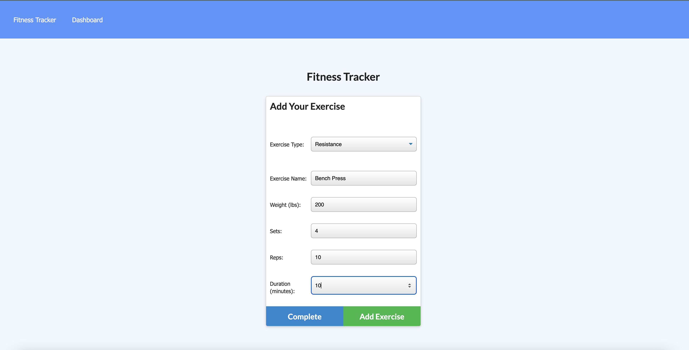

# Workout_Tracker

## Description
As a user, I want to be able to view create and track daily workouts. I want to be able to log multiple exercises in a workout on a given day. I should also be able to track the name, type, weight, sets, reps, and duration of exercise. If the exercise is a cardio exercise, I should be able to track my distance traveled.
## Table of Contents
* [Installation](#installation)
* [Usage](#usage)
* [Preview](#preview)
* [Contribution](#contribution)
* [License](#license)
* [Questions](#questions)

## Installation
1. NPM install
2. dependencies: 
    - Express 
    - Mongoose 
    - Morgan

## Usage
Add exercises to the most recent workout plan, add new exercises to new workout plan, view combined weight of multiple exercises from the past seven workouts on the `stats` page, view total duration of each workout from past seven workouts on `stats` page.

# Preview 
> Preview  

## Contribution
Reach out to me to contribute to this project

## Questions
For questions about this project, please see my GitHub at [mgmedrano](https://github.com/mgmedrano), or reach out by email at mgmedrano0203@gmail.com.

## License
Licensed under MIT License.